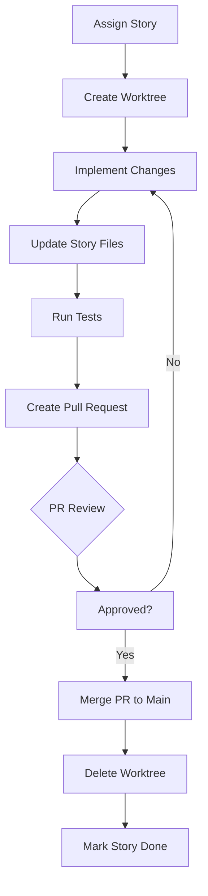

# Development Guide - Rookie On Quest

This document provides internal development guidelines, setup instructions, and workflows for contributing to Rookie On Quest, including multi-agent development coordination.

## Development Environment

### Prerequisites

- **JDK:** 17 or higher
- **Android Studio:** Hedgehog (2023.1.1) or newer
- **Gradle:** 8.0+ (managed by Gradle Wrapper)
- **Git:** 2.40+ with worktree support
- **ADB:** Android Debug Bridge for Quest deployment
- **Node.js:** Required for some build scripts (install via `npm install`)

### Initial Setup

```bash
# Clone repository
git clone https://github.com/your-org/rookie-on-quest.git
cd rookie-on-quest

# Grant execute permissions to Gradle wrapper (Linux/Mac)
chmod +x gradlew

# Open project in Android Studio
# File → Open → Navigate to cloned directory
```

### IDE Configuration

**Recommended Plugins:**
- **Kotlin:** Language plugin for Kotlin
- **Compose:** Jetpack Compose plugin
- **Room:** Room database schema viewer
- **Git:** Git integration for version control

## Project Architecture

### Technology Stack

- **Language:** Kotlin 100%
- **UI Framework:** Jetpack Compose
- **Database:** Room (SQLite wrapper)
- **Async:** Coroutines + StateFlow
- **Background Work:** WorkManager
- **Dependency Injection:** Manual (no DI framework)
- **Image Loading:** Coil
- **Archive Extraction:** Apache Commons Compress (7z)

### Module Structure

```
app/                               # Main application module
├── src/main/java/com/vrpirates/rookieonquest/
│   ├── data/                     # Data layer (Room entities, DAOs, repositories)
│   ├── ui/                       # UI layer (Compose screens, ViewModels)
│   ├── network/                  # Network layer (API clients, retrofit services)
│   ├── model/                    # Data models
│   └── utils/                     # Utility classes
└── build.gradle.kts               # App-level build configuration
```

## Multi-Agent Development with Git Worktrees

### Overview

This project supports parallel AI agent (or human) development using isolated git worktrees. Each agent works on a single story at a time in an isolated workspace.

### Architecture

```
Main Repository
│
├── worktrees/                    # Auto-created worktrees
│   ├── agent1-story-1-1/          # Agent 1 workspace
│   │   ├── .story-id              # Story identifier: "1-1"
│   │   ├── .story-files           # Files modified by this story
│   │   └── [full repo checkout]
│   ├── agent2-story-2-1/          # Agent 2 workspace
│   │   ├── .story-id              # Story identifier: "2-1"
│   │   ├── .story-files           # Files modified by this story
│   │   └── [full repo checkout]
│   └── ...
│
├── sprint-status.yaml             # Story tracking system
├── docs/                        # Architecture documentation
└── _bmad-/                      # BMAD methodology artifacts
```

### Naming Conventions

**Worktree Path:** `worktrees/{agent}-story-{epic}-{story-number}/`

**Branch Name:** `{agent}-story-{epic}-{story-number}`

**Examples:**
| Worktree | Branch | Story ID | Epic |
|----------|--------|----------|------|
| `worktrees/agent1-story-1-1/` | `agent1-story-1-1` | `1-1` | 1 (Persistence) |
| `worktrees/agent2-story-2-1/` | `agent2-story-2-1` | `2-1` | 2 (Stickman) |
| `worktrees/agent1-story-1-2/` | `agent1-story-1-2` | `1-2` | 1 (Persistence) |

### Quick Start (Universal Script)

**Compatible with ANY agent (Claude, Qwen, Cursor, Copilot, human):**

```bash
# From main repository root

# Linux/Mac
./scripts/init-worktree.sh 1-1 agent1

# Windows
scripts\init-worktree.bat 1-1 agent1

# The script automatically creates:
# - Git worktree and branch
# - .story-id file (contains "1-1")
# - .story-files manifest
# - Verifies setup
```

Then navigate to worktree and run your agent workflow:
```bash
cd worktrees/agent1-story-1-1
# Agent auto-detects story from .story-id file
```

### Manual Worktree Initialization

Alternative manual setup process:

```bash
# From main repository root
cd /path/to/rookie-on-quest

# Create worktree and branch
git worktree add ../rookie-onquest worktrees/agent1-story-1-1 -b agent1-story-1-1

# Navigate to worktree
cd worktrees/agent1-story-1-1

# Create story identifier file
echo "1-1" > .story-id

# Create story files manifest (see below)
cat > .story-files << EOF
storyId: "1-1"
storyTitle: "Room Database Queue Table Setup"
storyFiles:
  - app/src/main/java/com/vrpirates/rookieonquest/data/*.kt
  - app/src/main/java/com/vrpirates/rookieonquest/ui/MainViewModel.kt
  - app/build.gradle.kts
modifiedDuringStory: []
EOF

# Verify setup
pwd
cat .story-id
ls -la .story-files
```

### Agent Story Detection

**Automatic Detection:**

```kotlin
// Utility function for agents to detect current story
fun getCurrentStoryId(): String {
    val storyIdFile = File(System.getProperty("user.dir"), ".story-id")
    return if (storyIdFile.exists()) {
        storyIdFile.readText().trim()
    } else {
        throw IllegalStateException("Not in a story worktree! .story-id file not found.")
    }
}

// Usage
val storyId = getCurrentStoryId() // Returns: "1-1", "2-1", etc.
```

**Bash Detection:**

```bash
# From anywhere in the worktree
STORY_ID=$(cat .story-id 2>/dev/null)
echo "Currently working on: $STORY_ID"

# Get story title from sprint-status.yaml
grep -A 1 "$STORY_ID:" ../_bmad-output/implementation-artifacts/sprint-status.yaml | head -2
```

## Story Assignment Workflow

### 1. Check Availability

Before starting a story, verify it's not assigned:

```bash
# Check sprint status
grep -A 2 "^  ${STORY_ID}:" _bmad-output/implementation-artifacts/sprint-status.yaml

# Check if worktree exists
ls worktrees/ | grep $STORY_ID
```

### 2. Create Worktree

```bash
# Create worktree from main repository root
git worktree add ../rookie-onquest worktrees/$STORY_ID -b $AGENT-story-$EPIC-$STORY

# Example:
# git worktree add ../rookie-onquest worktrees/1-1 -b agent1-story-1-1
```

### 3. Initialize Story Environment

```bash
cd worktrees/$STORY_ID

# Create .story-id
echo $STORY_ID > .story-id

# Create .story-files manifest (see section below)
cat > .story-files << EOF
storyId: "$STORY_ID"
storyTitle: "$(grep -A 2 "^  ${STORY_ID}:" ../_bmad-output/implementation-artifacts/sprint-status.yaml | tail -1 | tr -d ' ')"
storyFiles:
  - app/src/main/java/com/vrpirates/rookieonquest/data/*.kt
  - app/src/main/java/com/vrpirates/rookieonquest/ui/MainViewModel.kt
  - app/build.gradle.kts
modifiedDuringStory: []
EOF
```

### 4. Verify Setup

```bash
# Confirm story assignment
cat .story-id

# List files that will be modified
grep "storyFiles:" .story-files -A 20

# Show git status
git status
```

### 5. Start Development

```bash
# Work on story implementation
code .  # Opens worktree in IDE

# Or open Android Studio at worktree location
```

## Story Files Manifest

### Purpose

The `.story-files` manifest serves two purposes:

1. **Conflict Prevention:** Lock files being modified by this story
2. **Documentation:** Track which files are touched by the story

### Format

```yaml
storyId: "1-1"
storyTitle: "Room Database Queue Table Setup"
storyFiles:
  - app/src/main/java/com/vrpirates/rookieonquest/data/*.kt
  - app/src/main/java/com/vrpirates/rookieonquest/ui/MainViewModel.kt
  - app/build.gradle.kts
modifiedDuringStory: []  # Populated during development
```

### Updating During Development

When a file is modified:

```kotlin
// Before making changes, add to manifest
// In Agent code or manual update

modifiedDuringStory += "app/src/main/java/com/vrpirates/rookieonquest/data/QueuedInstallEntity.kt"
```

### Conflict Detection

Before creating PR, check for conflicts:

```bash
# Check all active story manifests
find worktrees/ -name ".story-files" -exec cat {} \; | grep -h "$FILE_TO_MODIFY"

# Example: Check if MainViewModel.kt is locked
find worktrees/ -name ".story-files" -exec grep -h "MainViewModel.kt" {} \;
```

## Development Workflow

### Story Development Cycle



### Story Status Transitions

| Status | Description | Transition |
|--------|-------------|-----------|
| `backlog` | Story planned but not assigned | → `ready-for-dev` |
| `ready-for-dev` | Story assigned and worktree created | → `in-progress` |
| `in-progress` | Agent actively implementing | → `review` |
| `review` | Implementation complete, awaiting review | → `done` (if approved) or `in-progress` (if rejected) |
| `done` | Story validated and merged | N/A |

## Validation and Quality Gates

### Pre-PR Checklist

Before creating pull request:

1. **Unit Tests Pass:**
   ```bash
   ./gradlew test
   ```

2. **Instrumented Tests Pass:**
   ```bash
   ./gradlew connectedAndroidTest
   ```

3. **Code Coverage ≥80%:**
   ```bash
   ./gradlew jacocoTestReport
   # Verify coverage report
   ```

4. **Lint Clean:**
   ```bash
   ./gradlew lint
   ```

5. **Build Succeeds:**
   ```bash
   ./gradlew assembleDebug
   ```

6. **Story Files Updated:**
   - All modified files listed in `.story-files`
   - No files marked as modified that weren't touched

### Validation Workflow

For AI agents, the validation workflow is triggered manually:

1. **Agent checks:** Story status in `sprint-status.yaml`
2. **If status != "done":** Abort PR creation, await validation
3. **If status == "done":** Proceed with PR creation

## Pull Request Process

### Automatic Pull Request Creation (AI Agents)

```bash
# From within story worktree

# 1. Check story validation status
STORY_ID=$(cat .story-id)
STATUS=$(grep "^  ${STORY_ID}:" ../_bmad-output/implementation-artifacts/sprint-status.yaml | grep -oP 'done|review|backlog')

if [ "$STATUS" = "done" ]; then
    echo "Story validated, creating pull request"

    # 2. Push branch to remote
    git push -u origin $STORY_ID

    # 3. Create pull request with gh CLI
    gh pr create \
        --title "[Story $STORY_ID] $(grep "^  ${STORY_ID}:" ../_bmad-output/implementation-artifacts/sprint-status.yaml | cut -d':' -f2- | xargs)" \
        --body "## Summary
Story $STORY_ID completed and validated per sprint-status.yaml.

## Changes
$(git log main..HEAD --oneline)

## Test Results
- Unit tests: PASS
- Instrumented tests: PASS
- Code coverage: ≥80%
- Lint: CLEAN

## Files Modified
$(cat .story-files | grep -A 100 'storyFiles:' | tail -n +2)

---
🤖 Generated by Claude Code (BMAD workflow)"

    # 4. Wait for PR approval and merge
    # Agent monitors PR status via: gh pr view $STORY_ID
    # Once merged, proceed to cleanup

    # 5. After merge, delete worktree and branch
    # (Triggered manually or by automation after merge confirmation)
    cd ../..  # Back to main repo root
    git worktree remove worktrees/$STORY_ID
    git branch -D $STORY_ID

else
    echo "Story not validated yet. Status: $STATUS"
    echo "Awaiting validation before creating PR."
fi
```

### Manual Pull Request (Human Developers)

1. **Create Pull Request** from story branch to `main`
2. **Title:** `[Story {story-id}] {story title}`
3. **Description:**
   - Summary of changes
   - Test results (pass/fail)
   - Screenshots (if UI changes)
   - Related issues
4. **Assign Reviewer:** Request review from team lead
5. **Address Feedback:** Make requested changes
6. **Merge After Approval:** Maintainer merges PR to `main`

## Multi-Agent Coordination

### Status Monitoring

Check all active worktrees:

```bash
echo "=== Active Worktrees ==="
for worktree in worktrees/*; do
    if [ -f "$worktree/.story-id" ]; then
        STORY_ID=$(cat "$worktree/.story-id")
        AGENT=$(echo $worktree | cut -d'-' -f1)
        BRANCH=$(git -C ../.. branch --show-current)
        FILES=$(grep "storyFiles:" "$worktree/.story-files" | wc -l)
        echo "$AGENT | Story: $STORY_ID | Branch: $BRANCH | Files: $FILES"
    fi
done
```

### Conflict Resolution

**Preventing Conflicts:**

When starting a story, check file locks:

```bash
# Check if files are locked by another story
FILE="app/src/main/java/com/vrpirates/rookieonquest/ui/MainViewModel.kt"
for manifest in worktrees/*/.story-files; do
    if grep -q "$FILE" "$manifest"; then
        echo "WARNING: $FILE locked by $(dirname $manifest)"
        echo "Contact team for reassignment"
    fi
done
```

**Resolving Merge Conflicts:**

```bash
# Identify conflicting stories
git status  # Show conflicted files

# Check which stories lock these files
for FILE in $(git diff --name-only --diff-filter=U); do
    grep -r "$FILE" worktrees/*/.story-files 2>/dev/null || true
done
```

## CI/CD Integration

### Build Validation (FR71)

When creating PR or merging, CI/CD automatically validates:

1. **Debug build** + lint checks
2. **Unit test execution**
3. **Code coverage verification**
4. **APK byte-identical verification** (NFR-B5)

### Release Automation (FR61-FR73)

See `CONTRIBUTING.md` for full CI/CD workflow.

## Debugging

### Common Issues

**Issue:** Tests fail in worktree but pass in main repo
- **Cause:** Relative paths or hardcoded paths
- **Fix:** Use `../../../` for references outside worktree

**Issue:** Cannot sync Gradle in worktree
- **Cause:** Gradle cache conflicts
- **Fix:** Invalidate caches (`./gradlew clean --refresh-dependencies`)

**Issue:** Story worktree grows large over time
- **Cause:** Build artifacts, caches
- **Fix:** Add worktree/.gitignore with:
  ```
  .gradle/
  build/
  .idea/
  ```

### Agent-Specific Debugging

**For AI Agents:**

**Issue:** Cannot detect current story
- **Diagnosis:** `.story-id` file missing or corrupted
- **Fix:** Recreate from sprint-status.yaml or switch from main repo

**Issue:** PR creation blocked by validation
- **Diagnosis:** Story status not "done" in sprint-status.yaml
- **Fix:** Contact human team or await validation workflow completion

**Issue:** Worktree creation fails
- **Diagnosis:** Worktree already exists for that story
- **Fix:** Remove existing worktree first:
  ```bash
  git worktree remove worktrees/$STORY_ID
  ```

## Best Practices

### For AI Agents

1. **Always read .story-id** before making changes
2. **Update .story-files** when adding new files to story
3. **Check validation status** before creating PR
4. **Create clear commit messages** with story references
5. **Clean up worktrees** after successful PR merge

### For Human Developers

1. **Follow naming conventions** for branches and worktrees
2. **Update story files** when modifying new files
3. **Run tests locally** before pushing
4. **Create descriptive PRs** with story context
5. **Clean up** after story completion (delete worktree)

### File Organization

**Files to modify during story development:**
- Source code: `app/src/main/java/com/vrpirates/rookieonquest/`
- Tests: `app/src/test/`, `app/src/androidTest/`
- Build config: `app/build.gradle.kts`
- Resources: `app/src/main/res/` (if UI changes)

**Files to avoid:**
- Build artifacts (generated by Gradle)
- IDE configuration files (`.idea/`)
- Local configuration (`local.properties`)
- Worktree metadata (`.git/`)

## Troubleshooting

### Worktree Creation Fails

```bash
# Worktree already exists
git worktree remove worktrees/agent1-story-1-1

# Branch already exists
git branch -D agent1-story-1-1
```

### Merge Conflicts (During PR Merge)

```bash
# Conflicts are resolved in the PR before merging
# Use GitHub web interface to resolve conflicts
# Or resolve locally:
git checkout main
git pull
git checkout agent1-story-1-1
git merge main
# Resolve conflicts, then push
git push
```

### Story Files Not Updating

```bash
# Manual update required
# Edit .story-files with new files
```

## Summary

- **Use git worktrees** for isolated story development
- **Follow naming conventions** for branches
- **Maintain .story-id** for story detection
- **Update .story-files** when modifying files
- **Check validation status** before creating PR
- **Clean up worktrees** after completion

For detailed contribution guidelines, see `CONTRIBUTING.md`.

For project architecture, see `docs/architecture-app.md`.
