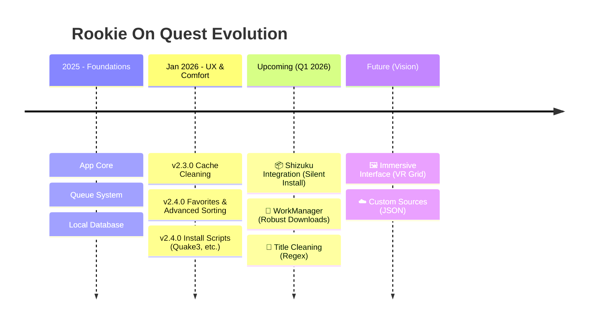
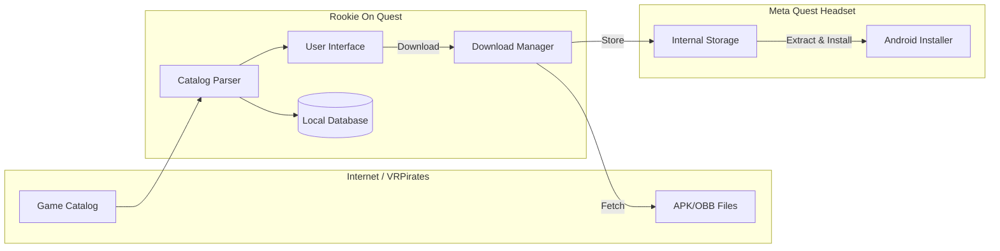

# 🚀 Rookie On Quest - Project Dashboard

Welcome to the **Rookie On Quest** dashboard. This document provides a clear overview of the project's current status, recent history, and upcoming features, designed to be readable at a glance.

---

## 📊 Global Project Status

| Indicator | Current Value | Description |
| :--- | :--- | :--- |
| **Version** | `2.4.0` | Stable, including Favorites and Advanced Sorting. |
| **Health** | 🟢 **Stable** | Core features (Download, Extract, Install) are operational. |
| **Current Focus** | 🔧 **System** | Shizuku Integration (silent installs) & WorkManager. |
| **Last Update** | Jan 05, 2026 | Added Favorites, Advanced Sorting, Install Scripts. |

---

## 🗺️ Visual Roadmap

Here is how the project has evolved and where it is heading.

---

## 🚧 Work In Progress (Priorities)

These features are currently on the workbench. They aim to make the application more autonomous and robust.

### 🔴 Priority 1: Critical Infrastructure
*   **Shizuku Integration**: Enable game installation without having to click "Confirm" every time. This will make the experience close to an official store.
*   **WorkManager (Background Tasks)**: Replace the current system so downloads continue reliably even if the app is minimized or if the system tries to stop it to save battery.

### 🟠 Priority 2: User Experience
*   **Title Cleaning**: An intelligent system to remove technical tags (e.g., `[v123]`, `(Multi)`) from game names for a cleaner list.
*   **Foreground Service**: A persistent notification to better manage and visualize ongoing downloads outside the app.

---

## 🏗️ Simplified Architecture

How does the app work under the hood?

---

## 🔮 The Future (Backlog)

Planned for later, once technical foundations (Shizuku/WorkManager) are complete.

*   **Immersive Grid Mode**: A grid view with large game posters, optimized for viewing through VR headset lenses.
*   **Backups**: Backup and restore game data (`/Android/data`).
*   **External Sources**: Ability to add your own game sources (JSON files).

---

*This document is automatically generated by the BMM Architect based on `ACTION_PLAN.md`.*
